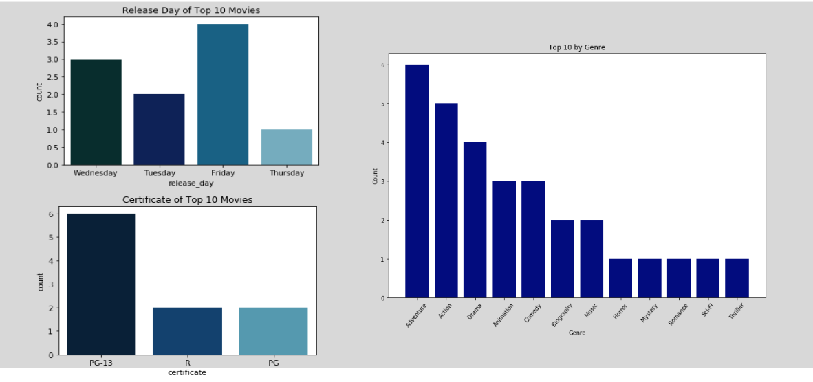

# Mod1 Project: The 2018-2019 Film Landscape

## Lab Members:
- Sam Jackson
- Adam Dick

## Assigned Project Goals:
- Examine the success of films and compare films across variables. 
- Be creative with definition of success.
- Determine where there are significant differences in the success of films.
- Give at least two actionable insights 
- Use git as a collaborative tool for this project to manage version control and history. 

## Methodology 
- **Scraping**: Gather and analyze data for all feature films released in 2018 or 2019  
  ○ Recent data will give us the pulse of current audience/consumer demand 
  ○ Movie data scraped from IMDB
- **Pinging**: Gather and analyze more detailed data for top rated movies, based on IMDB rating 
  ○ Using IMDB rating allows us to include less popular and/or global movies with smaller # of votes on IMDB 
  ○ Detailed data pulled from The Movie Database API
- **Querying and Exploring**: Chart relationships that can guide Lionsgate business decisions 
  ○ Cleaned and stored data tables in SQL database 
  ○ Recommendations assume a successful movie is one that is liked (highly rated/scored) by consumers
  
## Insights
For movies released in 2018-2019:
### Highest scoring* genres (adventure, scifi, action) tend to be the most voted on genres.  Genres with the highest IMDB rating tend to not have highest viewership

### PG-13 movies are popular AND high scoring

### The top 10 highest scoring movies were released on weekdays (Tues-Friday) with the most being released on Friday.  Most were PG-13, and most were in the adventure genre.

### Big budget blockbusters are risky: they don't always result in the highest payoff in terms of profit or in terms of score. The most popular films do not necessarily have the broadest viewer base nor require the largest budgets.

 *(score = IMDb rating * number of votes) 
 

